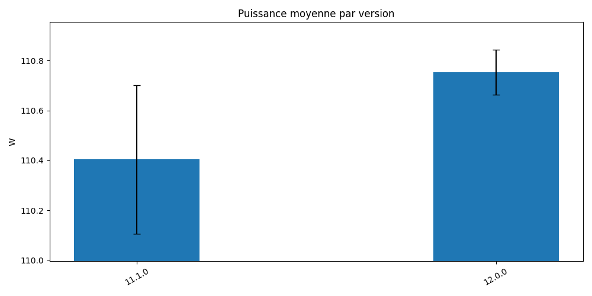
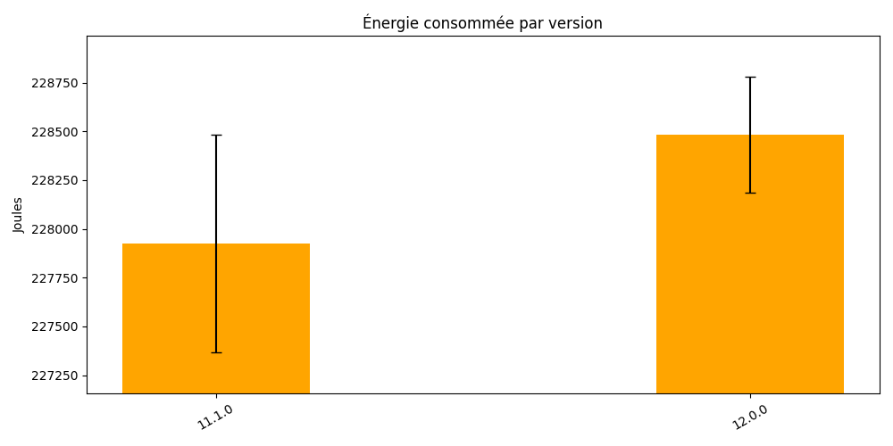

# Test Benchmark JMH — Eclipse Collections

Projet de benchmarking Java utilisant **JMH** (Java Microbenchmark Harness) et **Eclipse Collections**, piloté par des scripts Python. Développé dans le cadre du TER.

## Prérequis

| Outil | Version minimale | Vérification |
|---|---|---|
| **Java (JDK)** | 17 | `java -version` |
| **Python** | 3.8+ | `python --version` |
| **pip** | — | `pip --version` |

Les dépendances Python nécessaires au fonctionnement des scripts d'analyse sont à installer avant la première exécution :

```bash
pip install matplotlib pandas
```

> **Note :** Gradle est embarqué dans le projet via le Gradle Wrapper (`gradlew` / `gradlew.bat`). Il n'est pas nécessaire de l'installer séparément.

---

## Déploiement sur Grid5000

Les benchmarks sont conçus pour être exécutés sur l'infrastructure **Grid5000**, et plus précisément sur le cluster **Taurus** du site de **Lyon**. Ce cluster offre des nœuds homogènes avec des compteurs de puissance physiques (wattmètres), indispensables pour collecter les métriques énergétiques.

### Description technique — Nœuds Taurus (Lyon)

| Caractéristique | Détail |
|---|---|
| **Cluster** | `taurus` |
| **Site** | Lyon |
| **CPU** | Intel Xeon E5-2630 v3 @ 2.30 GHz 2 CPUs/node, 6 cores/CPU |
| **RAM** | 32 GiB |
| **Storage** | disk0, 299 GB HDD RAID-0 (1 disk) Dell PERC H710 |
| **OS** | Debian / Ubuntu (environnement Grid5000) |
| **Mesure énergétique** | Wattmètre physique intégré (via **kwollect** / `wattmetre_power_watt`) |
| **Réseau** | 10 Gbit/s |

> Les wattmètres physiques de Taurus permettent de mesurer la consommation réelle du nœud en temps réel via l'API **kwollect** de Grid5000.

---

### Étape 1 — Se connecter à Grid5000

Depuis votre machine locale, connectez-vous au site de Lyon :

```bash
ssh <login>@access.grid5000.fr
ssh lyon.grid5000.fr
```

---

### Étape 2 — Réserver un nœud Taurus

Utilisez **OAR** (le gestionnaire de ressources de Grid5000) pour réserver un nœud du cluster Taurus. Adaptez la durée selon vos besoins.

**Réservation interactive (pour tests) :**

```bash
oarsub -l host=1,walltime=8:00:00 -p "cluster='taurus'"
```

Une fois la réservation accordée, l'identifiant du job OAR est disponible dans la variable d'environnement `$OAR_JOB_ID`. Le nom du nœud alloué est accessible via `hostname -s`.

---

### Étape 3 — Préparer l'environnement sur le nœud

Une fois connecté sur le nœud alloué, installez les dépendances système si nécessaire :

```bash
# Vérifier Java 17
java -version

# Installer Python et les dépendances si absentes
pip3 install --user matplotlib pandas
```

---

### Étape 4 — Cloner le dépôt

```bash
git clone https://github.com/BraKann/Test_Benchmark_JMH_EclipseCollection.git
cd Test_Benchmark_JMH_EclipseCollection
```

---

### Étape 5 — Compiler le JAR de benchmarks

```bash
./gradlew jmhJar
```

> Pour tester avec une version spécifique d'Eclipse Collections :
> ```bash
> ./gradlew jmhJar -PecVersion=12.0.0
> ```

---

## Fichiers Gradle

### `build.gradle`

Fichier de configuration principal du projet. Il définit :

- Le **plugin JMH** (`me.champeau.jmh` v0.7.2) qui ajoute le support des benchmarks JMH au build Gradle.
- La **version d'Eclipse Collections**, injectable dynamiquement via la propriété `-PecVersion` (par défaut `11.1.0`).
- Les **dépendances** : `eclipse-collections-api`, `eclipse-collections`, `jmh-core` et `jmh-generator-annprocess` (JMH 1.37).
- La **toolchain Java 17** utilisée pour la compilation.
- La **configuration JMH par défaut** pour un lancement manuel via `./gradlew jmh` :

| Paramètre | Valeur | Description |
|---|---|---|
| `iterations` | `5` | Nombre d'itérations de mesure |
| `warmupIterations` | `5` | Nombre d'itérations de chauffe |
| `fork` | `2` | Nombre de JVM forké(s) par benchmark |
| `timeUnit` | `ms` | Unité de temps des résultats |
| `benchmarkMode` | `avgt` | Mode : temps moyen par opération |
| `resultsFile` | `build/reports/jmh/results.txt` | Fichier de sortie des résultats |

> Ces valeurs ne s'appliquent qu'au lancement via `./gradlew jmh`. Les scripts `run_simple.py` et `run_campaign.py` passent leurs propres paramètres directement à la CLI du JAR JMH.

### `settings.gradle`

Déclare le nom du projet Gradle. Fichier minimal, il n'est généralement pas nécessaire de le modifier.

### `gradle/wrapper/gradle-wrapper.properties`

Définit la version de Gradle utilisée par le wrapper. Gradle est automatiquement téléchargé à la première exécution si absent.

### `gradlew` / `gradlew.bat`

Scripts exécutables du Gradle Wrapper. À utiliser à la place de `gradle` pour garantir la bonne version :

```bash
# Linux / macOS
./gradlew <tâche>

# Windows
gradlew.bat <tâche>
```

---

## Lancer `run_simple`

`run_simple.py` effectue **un run JMH unique** sur une configuration donnée, analyse les résultats et produit une sortie immédiatement exploitable.

### Étape 1 — Exécuter le script

`run_simple.py` s'utilise depuis le nœud Taurus réservé. Voici la commande complète avec tous ses arguments :

```bash
python3 run_simple.py \
  --versions 11.1.0 12.0.0 \
  --site lyon \
  --node "$(hostname -s)" \
  --job-id "$OAR_JOB_ID" \
  --metrics wattmetre_power_watt \
  --includes 'benchmark.(List|Map|Set|Bag).*' \
  --iterations 5 \
  --warmup-iterations 2 \
  --forks 1 \
  --iteration-time 1s \
  --warmup-time 1s \
  --idle-seconds 30 \
  --rest-seconds 10
```

### Description des arguments

| Argument | Exemple | Description |
|---|---|---|
| `--versions` | `11.1.0 12.0.0` | Versions d'Eclipse Collections à benchmarker. Le script construit et exécute un run JMH pour chacune. |
| `--site` | `lyon` | Site Grid5000 utilisé. Sert à identifier la machine dans les métadonnées des résultats. |
| `--node` | `$(hostname -s)` | Nom court du nœud alloué (ex. `taurus-4`). Renseigné automatiquement via `hostname -s`. |
| `--job-id` | `$OAR_JOB_ID` | Identifiant du job OAR. Automatiquement disponible dans l'environnement après `oarsub`. |
| `--metrics` | `wattmetre_power_watt` | Métrique kwollect à collecter. `wattmetre_power_watt` correspond au wattmètre physique de Taurus. |
| `--includes` | `'benchmark.(List\|Map\|Set\|Bag).*'` | Regex JMH pour filtrer les benchmarks à exécuter. Ici : toutes les classes `List`, `Map`, `Set`, `Bag`. |
| `--iterations` | `5` | Nombre d'itérations de mesure JMH. |
| `--warmup-iterations` | `2` | Nombre d'itérations de chauffe JMH (non comptabilisées dans les résultats). |
| `--forks` | `1` | Nombre de JVM forkées par benchmark. |
| `--iteration-time` | `1s` | Durée de chaque itération de mesure. |
| `--warmup-time` | `1s` | Durée de chaque itération de chauffe. |
| `--idle-seconds` | `30` | Fenêtre d'inactivité avant chaque run, pendant laquelle kwollect mesure la consommation au repos (idle). |
| `--rest-seconds` | `10` | Pause entre deux runs successifs. |

Le script appelle en interne la CLI JMH sur le JAR compilé, pilote la collecte kwollect en parallèle, et génère l'analyse à la fin.

---

### Métriques produites par `run_simple`

`run_simple.py` produit trois types de sorties trouvable dans build/campagne :

**Fichier JSON** — Données brutes des benchmarks

**Graphique 1 — Puissance moyenne par version** 

**Graphique 2 — Énergie consommée par version** 
---

### Résultats run_simple





**Résultats JSON bruts**

<details>
<summary>Afficher le JSON</summary>

```json
```json
[
  {
    "version": "11.1.0",
    "iterations": [
      {
        "version": "11.1.0",
        "iteration": 1,
        "started_at": "2026-04-27T14:04:23.449882Z",
        "ended_at": "2026-04-27T14:38:47.200887Z",
        "duration_seconds": 2063.751005,
        "jmh_exit_code": 0,
        "idle_window": {
          "start": "2026-04-27T14:03:53.419703Z",
          "end": "2026-04-27T14:04:23.449821Z"
        },
        "kwollect_wattmetre_power_watt": {
          "samples": 85888,
          "duration_seconds": 2064.981162071228,
          "average_power_w": 110.10654047439313,
          "peak_power_w": 383.8,
          "energy_j": 227367.93190045503
        },
        "kwollect_idle_wattmetre_power_watt": {
          "samples": 1298,
          "duration_seconds": 30.978847980499268,
          "average_power_w": 79.94313305215002,
          "peak_power_w": 211.0,
          "energy_j": 2476.5461659073817
        },
        "net_energy_j_wattmetre_power_watt": 62385.210721231706
      },
      {
        "version": "11.1.0",
        "iteration": 2,
        "started_at": "2026-04-27T14:39:47.749225Z",
        "ended_at": "2026-04-27T15:14:10.132359Z",
        "duration_seconds": 2062.383134,
        "jmh_exit_code": 0,
        "idle_window": {
          "start": "2026-04-27T14:39:17.719019Z",
          "end": "2026-04-27T14:39:47.749153Z"
        },
        "kwollect_wattmetre_power_watt": {
          "samples": 85739,
          "duration_seconds": 2063.980889081955,
          "average_power_w": 110.70017457147442,
          "peak_power_w": 348.3,
          "energy_j": 228483.0447335594
        },
        "kwollect_idle_wattmetre_power_watt": {
          "samples": 1322,
          "duration_seconds": 30.938997983932495,
          "average_power_w": 79.14268547025115,
          "peak_power_w": 141.0,
          "energy_j": 2448.595386207104
        },
        "net_energy_j_wattmetre_power_watt": 65260.50504024656
      }
    ]
  },
  {
    "version": "12.0.0",
    "iterations": [
      {
        "version": "12.0.0",
        "iteration": 1,
        "started_at": "2026-04-27T15:15:14.801886Z",
        "ended_at": "2026-04-27T15:49:37.600042Z",
        "duration_seconds": 2062.798156,
        "jmh_exit_code": 0,
        "idle_window": {
          "start": "2026-04-27T15:14:44.771658Z",
          "end": "2026-04-27T15:15:14.801769Z"
        },
        "kwollect_wattmetre_power_watt": {
          "samples": 85502,
          "duration_seconds": 2063.981117963791,
          "average_power_w": 110.84365784955855,
          "peak_power_w": 411.5,
          "energy_j": 228779.2168475278
        },
        "kwollect_idle_wattmetre_power_watt": {
          "samples": 1309,
          "duration_seconds": 30.958774089813232,
          "average_power_w": 79.6062173225196,
          "peak_power_w": 176.5,
          "energy_j": 2464.510898232461
        },
        "net_energy_j_wattmetre_power_watt": 64567.65854849914
      },
      {
        "version": "12.0.0",
        "iteration": 2,
        "started_at": "2026-04-27T15:50:39.531211Z",
        "ended_at": "2026-04-27T16:25:00.470274Z",
        "duration_seconds": 2060.939063,
        "jmh_exit_code": 0,
        "idle_window": {
          "start": "2026-04-27T15:50:09.529229Z",
          "end": "2026-04-27T15:50:39.531157Z"
        },
        "kwollect_wattmetre_power_watt": {
          "samples": 85686,
          "duration_seconds": 2061.9809188842773,
          "average_power_w": 110.66308078295098,
          "peak_power_w": 445.2,
          "energy_j": 228185.16099939428
        },
        "kwollect_idle_wattmetre_power_watt": {
          "samples": 1319,
          "duration_seconds": 30.978930950164795,
          "average_power_w": 78.44326975190242,
          "peak_power_w": 133.2,
          "energy_j": 2430.0886371493357
        },
        "net_energy_j_wattmetre_power_watt": 66518.36213825227
      }
    ]
  }
]
```

</details>

---

## Lancer `run_campaign`

`run_campaign.py` lance une **campagne de benchmarks systématique** sur plusieurs versions d'Eclipse Collections et/ou plusieurs configurations. Il est conçu pour comparer l'évolution des performances entre versions.

La campagne peut prendre plusieurs heures selon le nombre de versions et de benchmarks configurés. Il est recommandé de lancer via une réservation OAR batch pour éviter toute interruption.

### Sorties de la campagne

Les résultats sont organisés dans un dossier de sortie (ex. `results/`) avec pour chaque run :

- Un fichier JSON par version testée
- Des graphiques de comparaison inter-versions générés automatiquement

---

### Métriques produites par `run_campaign`

En plus des métriques individuelles de chaque run (identiques à `run_simple`), `run_campaign.py` produit des métriques de comparaison :

| Métrique | Description |
|---|---|
| **Score (ms/op)** | Temps moyen par opération pour chaque benchmark × version |
| **Score Error (±)** | Intervalle de confiance à 99,9% sur le score |
| **Δ Score** | Variation relative du score entre deux versions |
| **Ranking** | Classement des implémentations par version |

---
